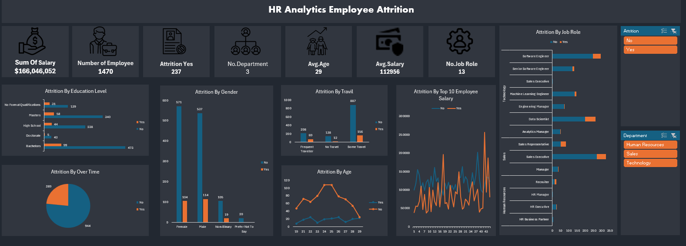

# HR Analytics Employee Attrition Dashboard Analysis

This document provides an analysis of the HR Analytics Employee Attrition dashboard image provided. The dashboard is designed to offer a comprehensive overview of employee attrition within an organization. It highlights key metrics, breakdowns of attrition by various factors, and provides filtering capabilities, enabling HR professionals or managers to identify patterns and potential areas for improvement.

## Key Metrics

*   **Sum of Salary:** $166,046,052 - The total salary paid to all employees.
*   **Number of Employee:** 1470 - The total number of employees in the organization.
*   **Attrition Yes:** 237 - The number of employees who have left the organization.
*   **No. Department:** 3 - Indicates there are three different departments in the company.
*   **Avg. Age:** 29 - The average age of employees within the organization.
*   **Avg. Salary:** 112,956 - The average salary of employees in the organization.
*   **No. Job Role:** 13 - Indicates the number of job roles within the organization.

## Breakdowns of Attrition

*   **By Education Level:**
    *   Employees with "Bachelors" degrees have the highest number of employees overall, and also moderately high rates of attrition.
    *   "Masters" degree holders have the second-highest number of employees, and also a considerable number who have attrited.
    *   "Doctorate" holders have the lowest attrition rate.

*   **By Gender:**
    *   Both males and females have the highest number of employees overall, and also relatively high rates of attrition.
    *   The "Prefer not to say" category has the fewest employees and a lower attrition rate.

*   **By Travel:**
    *   "Some Travel" is the largest group of employees, with a moderate attrition rate.
    *   "Frequent Traveler" employees have a higher attrition rate relative to their total number.

*   **By Age:**
    *   The attrition rate is highest among the 21-27 age group, peaking at age 26 and then decreases with increasing age.

*   **By Top 10 Employee Salary:**
    *   A line chart compares salaries for the top 10 highest paid employees, showing who stayed ("No") and who left ("Yes").
    *   Salaries for those who left tend to be lower than those who stayed over the time period represented.

*   **By Over Time:**
    *   A pie chart indicates that most employees (944) do not work overtime, while a substantial number (289) do.

*   **By Job Role:**
    *  "Software Engineer" and "Sales Executive" roles show higher attrition rates.
    *   "Analytics Manager", and "Engineering Manager" roles show relatively lower attrition rates.

## Filtering Capabilities

*   **Attrition (Yes/No):**  Filters data based on employee attrition status.
*   **Department:** Filters data by department, including "Human Resources," "Sales," and "Technology."

## Insights & Potential Questions

*   **Education Level Impact:** Understanding the reasons for higher attrition among those with "Bachelors" and "Masters" degrees might reveal issues.
*   **Gender Distribution:** The attrition rates across genders appear fairly balanced, suggesting no direct gender-related issues.
*   **Travel and Attrition:**  The correlation between frequent travel and higher attrition indicates this area should be investigated.
*   **Age Factors:** Higher attrition rates among younger employees may point to factors like lack of career development or work-life balance issues.
*   **Job Roles and Attrition:** The job roles with higher attrition, like "Software Engineer" and "Sales Executive," may need further analysis to identify common causes.
*   **Salary Analysis:**  Further investigation is needed to identify the reasons why employees who left had lower salaries and if it contributed to them leaving.

## Summary

This HR Analytics Employee Attrition dashboard provides a comprehensive picture of employee attrition within the organization. The multiple breakdowns help to examine attrition rates from different angles and identify key areas of concern. The filter options help HR professionals focus on specific data subsets. This allows them to make informed, data-driven decisions regarding employee retention strategies.

### Project Overview 

