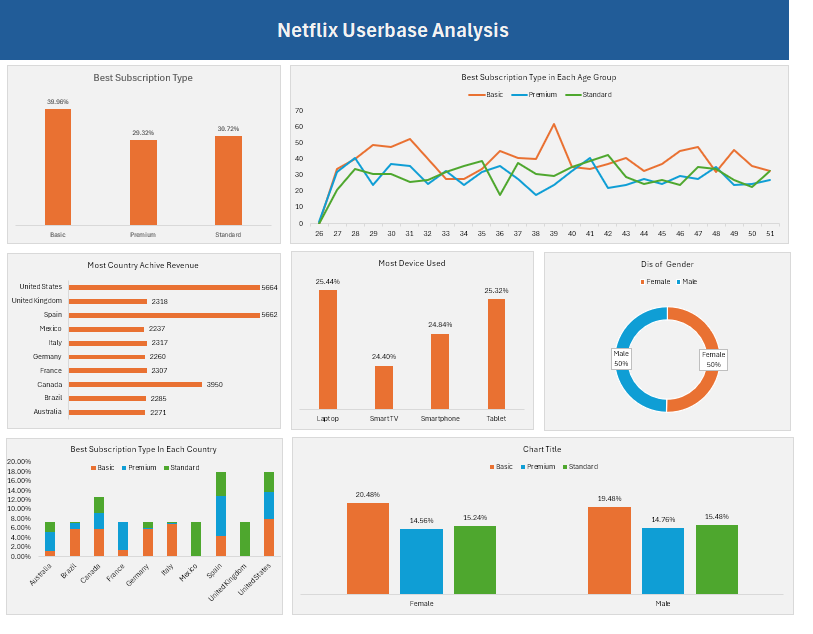

# Netflix Userbase Analysis Dashboard Analysis

This document provides an analysis of the Netflix Userbase Analysis dashboard image provided. The dashboard is designed to offer a snapshot of Netflix's user base, highlighting subscription preferences, revenue generation, device usage, and demographics. This is a tool for understanding customer behavior and identifying key trends related to user engagement with Netflix's services.

## Key Metrics and Breakdowns

1.  **Best Subscription Type:**
    *   A bar chart shows the "Basic" subscription is the most popular (39.98%), followed by "Standard" (30.72%) and "Premium" (29.32%).

2.  **Best Subscription Type in Each Age Group:**
    *   A line chart displays the distribution of subscription types across different age groups.
    *    The use of each plan fluctuates over age groups, with the "Basic" plan being more popular among younger demographics, and "Premium" being popular between the age of 33 and 42.

3.  **Most Country Achive Revenue:**
    *   A horizontal bar chart shows that the "United States" generates the most active revenue (5664), followed by Spain (5662), and Canada (3950).

4.  **Most Device Used:**
    *   A vertical bar chart highlighting that "Laptop" is the most used device (25.44%), followed by "Tablet" (25.32%) and "Smartphone" (24.84%).

5.  **Dis of Gender:**
    *   A donut chart displays a balanced distribution of the user base, with 50% "Male" and 50% "Female".

6.  **Best Subscription Type in Each Country:**
    *   A stacked bar chart shows the distribution of subscription types across various countries.
    *    "Basic" subscription seems to be most popular in "Australia", "Brazil", "Germany", "Italy", "Mexico", "Canada" and "Spain"
    *   "Premium" subscription seems most popular in "United States".

7.  **Chart Title:**
    *   A stacked bar chart showing that the "Basic" subscription is most popular amongst both "Male" and "Female" users.

## Insights & Potential Questions

*   **Subscription Preference:** The prevalence of the "Basic" plan may reflect price sensitivity, though a good portion of users opt for "Premium" and "Standard" options.

*   **Age-Related Patterns:** Further investigation is needed to identify the reasons behind the differences in subscription preferences among various age groups.

*   **Revenue Contribution:** The United States contributes the most active revenue, indicating the strategic importance of the market.

*   **Device Usage:** Similar usage rates of laptops and tablets might indicate varied user preferences depending on context or use case.

*   **Gender Balance:** The equal distribution across genders suggests a broad appeal of the service.

*   **Country Specific Preferences:** Varying subscription preferences across countries suggests potential localized marketing strategies.

## Summary

The Netflix Userbase Analysis dashboard offers a useful view into user demographics, behavior, and revenue generation. It helps to identify trends and patterns that may be useful in making data-driven decisions to improve the service or increase revenue.

### Project Overview

