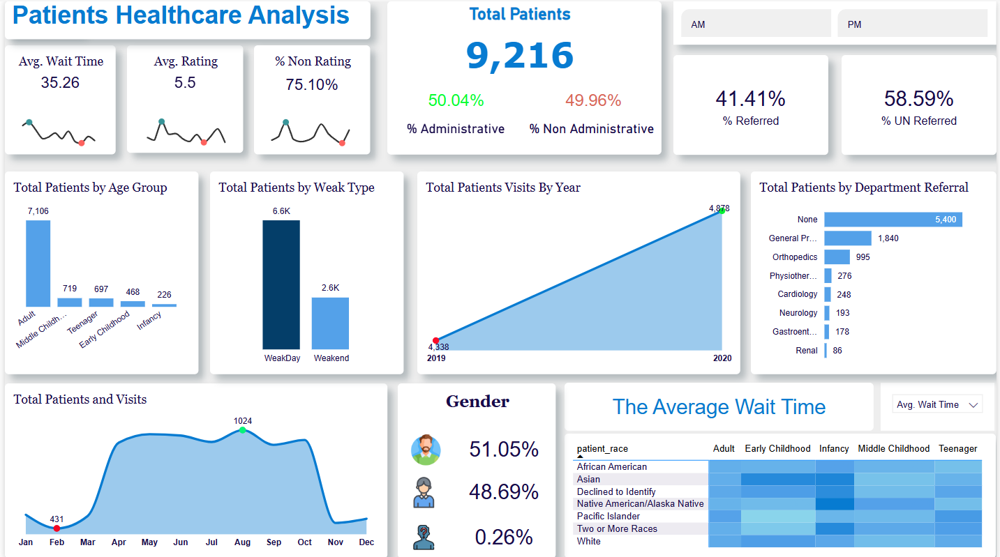

## Overall Summary

*   **Total Patients:** The clinic has served a total of 9,216 patients.
*   **Administrative vs. Non-Administrative:** The patient base is almost equally split between those categorized as administrative (50.04%) and non-administrative (49.96%).
*   **Referral Status:** A larger proportion of patients are unreferred (58.59%) compared to those referred (41.41%).
*   **Average Wait Time:** The average wait time for patients is 35.26 (likely minutes).
*   **Average Rating:** The average patient rating is 5.5 (on an assumed scale).
*   **Non-Rating Percentage:** A high percentage (75.10%) of patients did not provide a rating.

## Detailed Insights from Charts & Graphs

### 1. Key Performance Indicators (KPIs) at the Top

*   **Average Wait Time:** The trend line under the average wait time appears to show fluctuations, with a peak and a dip, although we can't interpret the x-axis.
*   **Average Rating:** Similar trend line to the average wait time.
*   **% Non Rating:** The trend line is also present here with similar peaks and dips.

### 2. Patient Demographics

*   **Total Patients by Age Group:** The vast majority of patients are adults (7,106). The other age groups have significantly lower numbers, with middle childhood (719), teenagers (697), early childhood (468), and infancy (226) coming in next largest groups.
*   **Total Patients by Week Type:** Significantly more patients are seen on weekdays (6.6K) than on weekends (2.6K), which is expected.
*   **Gender:** The gender distribution is fairly even, with slightly more patients identifying as male (51.05%) than female (48.69%). There is a very small percentage (0.26%) that are unkown.

### 3. Patient Visits and Referrals

*   **Total Patients Visits by Year:** Patient visits have increased substantially from 2019 to 2020 with almost a doubling of the total patients.
*   **Total Patients by Department Referral:** A very large majority of patients (5,400) are not referred to any specific department ("None"). General Practitioners (1,840) are the most common source of referrals. Orthopedics, Physiotherapy, Cardiology, Neurology, Gastroenterology, and Renal department have fewer referrals.
*   **Total Patients and Visits (Line Chart):** The monthly visits have a big peak around July and August with a large dip at the beginning of the year, and the tail end of the year. The largest number of visits in the year is 1024.

### 4. Average Wait Time by Race and Age

*   **Heatmap of Average Wait Times by Race and Age:** This chart gives us a more granular view of wait times, segmented by both race and age group. It uses color shading to represent the wait time, darker colors indicate longer wait times. Based on the colors, the wait time for different races is similar with small variations. However, in different age groups, they vary widely, especially with early childhood patients having a longer wait time in comparison to other age groups, and infants and adults have similar short wait times.

## Key Observations & Potential Action Points

*   **High Non-Rating Percentage:** The high percentage of patients not providing ratings suggests a need to investigate the rating system. It might be too cumbersome, not properly promoted, or patients don't see value in providing feedback. Encourage feedback to gather patient experience data.
*   **Adult Patient Predominance:** Given the high volume of adult patients, resources should be allocated appropriately to cater to their specific needs.
*   **Weekday vs. Weekend Disparity:** The large difference between weekday and weekend traffic patterns may affect staffing or operations.
*   **Referral Pattern:** The dominance of "None" in department referrals might indicate many walk-ins or patients who don't require specialization. Need to better understand the pattern of referrals.
*   **Wait Times:** The wait times for different race groups appears to be similar, but for age groups it varies significantly and there is a need to explore why there are wait time differences between different ages groups.
*   **Visit Volume Changes:** There are significant changes in the volume of visits throughout the year and they may need to be investigated, and potentially plan staffing accordingly.
*   **Increase in Total Visits:** The large increase in visits in 2020 from 2019 should also be investigated further.

## Further Questions

*   What does the x-axis represent in the Avg. Wait Time, Avg. Rating and % Non-Rating trend lines?
*   What is the timescale for the patients visits by year?
*   What is the scale used for patient rating?
*   What are the specific reasons for Administrative and Non-Administrative groupings of patients?
# Project Overview

## Conclusion

This dashboard provides a good overview of patient demographics, visit patterns, and key performance indicators. It highlights potential areas for further investigation and improvement, such as optimizing the rating system, and further investigating wait times by age. Using the data from this dashboard, the health care organization can potentially provide better services to their patients.
