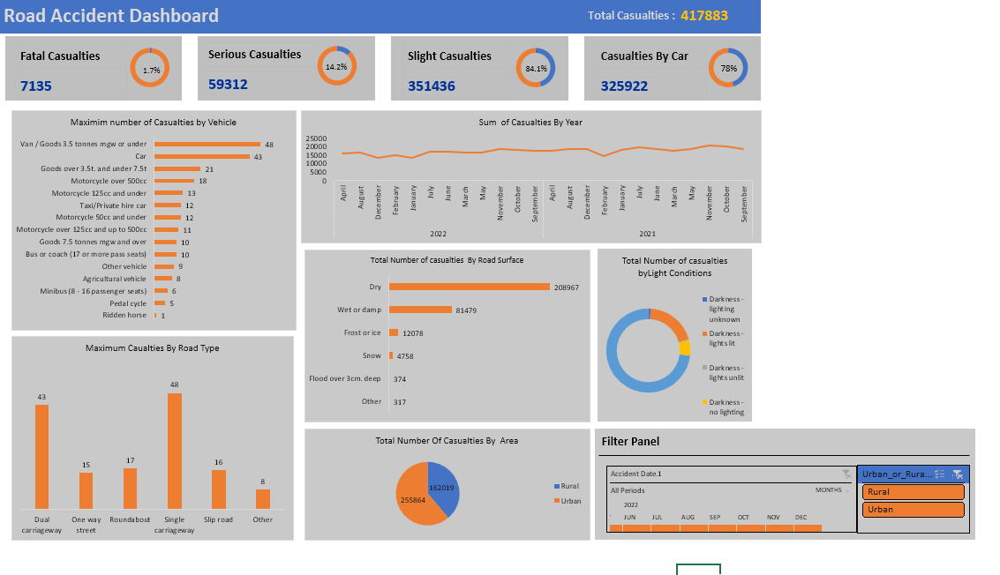

# Road Accident Dashboard Analysis

This document provides an analysis of the road accident dashboard image provided. The dashboard is designed to present a visual summary of road accident casualties, allowing for the identification of trends and patterns through filtering and drilling down into specific information. This is likely a tool for analyzing the causes and characteristics of road accidents.

## Key Metrics

*   **Total Casualties:** 417,883 - This is the total number of individuals injured or killed in road accidents recorded in the dataset.
*   **Fatal Casualties:** 7,135 (1.7%) - Represents the most severe category of casualties.
*   **Serious Casualties:** 59,312 (14.2%) - Indicates a significant number of casualties with serious injuries.
*   **Slight Casualties:** 351,436 (84.1%) - The most numerous category, implying mostly minor injuries.
*   **Casualties by Car:** 325,922 (78%) - A large majority of casualties are associated with accidents involving cars.

## Breakdowns of Casualties

*   **By Vehicle Type:**
    *   "Van / Goods 3.5 tonnes mgw or under" (48) and "Car" (43) are the vehicle types with the highest number of casualties. Motorcycle types also show a relatively higher rate of incidents.
    *   "Ridden horse" has the lowest number of casualties with just 1 incident.
*   **By Road Type:**
    *   "Single carriageway" (48) and "Dual carriageway" (43) are the road types where accidents are most prevalent.
*   **By Road Surface:**
    *   Accidents on "Dry" roads are far more common (208,967) than on any other surface, followed by "Wet or damp" surfaces (81,479).
*   **By Light Conditions:**
    *   Most accidents occurred in "Darkness-lighting unknown" conditions, highlighting a potential area of concern.

## Casualties Over Time

*   **Sum of Casualties by Year:**  A line graph shows the trend of total casualties over two years (2021 and 2022). It displays a clear seasonal pattern, with casualties generally peaking in summer and decreasing in late winter.

## Casualties By Area

*   **Total Number Of Casualties By Area:** A pie chart illustrates the distribution of casualties in urban and rural areas. Urban areas have a higher number of casualties with 255,864 accidents, while rural areas have 162,019.

## Filter Panel

*   **Accident Date.1:** Allows the user to filter data by the date and time of the accidents, with options for "All Periods" and by specific months in 2022.
*   **Urban\_or\_Rural...:**  Enables filtering of data based on whether the accident occurred in an urban or rural location.

## Insights & Potential Questions

*   **Vehicle Type Concentration:** The high number of car and van casualties warrants further investigation into potential contributing factors (e.g., volume of these vehicle types, driver behavior, speed, or vehicle size).
*   **Road Surface Paradox:** The high number of accidents on "Dry" surfaces is unexpected and calls for a more granular analysis, possibly considering factors like time of day and traffic volume.
*   **Light Condition Concerns:** The high accident rates in "Darkness-lighting unknown" conditions indicate the need to investigate the causes and address potential issues, such as poor lighting or visibility.
*   **Seasonal Patterns:** The clear seasonality of accidents (peak in summer) requires deeper analysis to understand why accidents are more frequent during these times.
*   **Urban vs Rural:** Understanding why urban areas are more accident-prone may help to reduce the accident rate.

## Summary

This dashboard serves as a comprehensive analytical tool for road accident data. It offers not only total casualty counts but also multiple breakdowns to enable a granular investigation into accident causes. The filter functionality enables users to focus on specific subsets of the data based on a variety of parameters. This dashboard can provide valuable insights for road safety planning and accident reduction efforts.

### Project Overview

